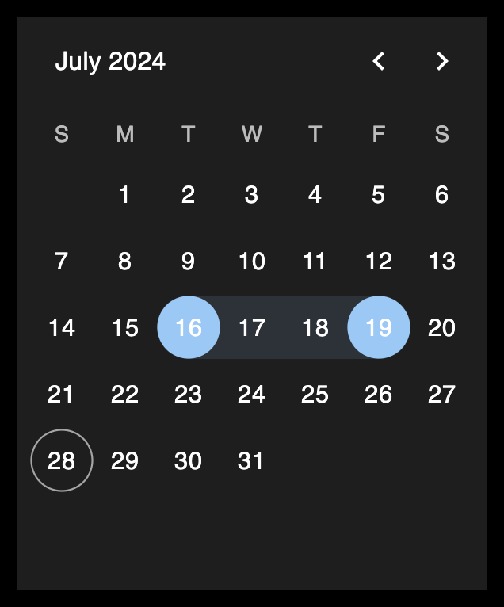
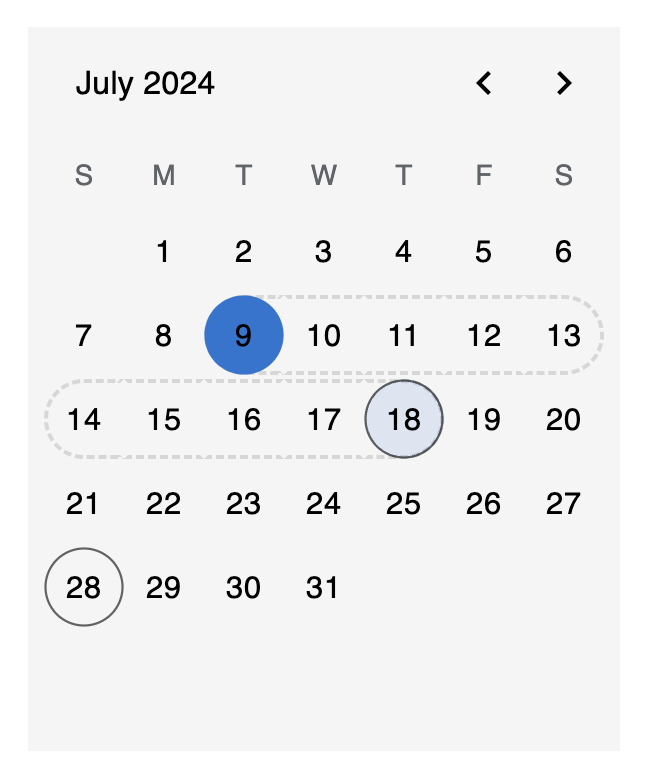

# Simple Date Range Calendar Monorepo

This repository contains the `simple-date-range-calendar` library and a demo project to showcase its functionalities.

## Project Structure

Within the `packages` folder, you will find the following directories:

- **simple-date-range-calendar**: Contains the `simple-date-range-calendar` library. This library provides React calendar components that support date and date range selection with light and dark theme support.
- **demo**: Contains the demo project which showcases the features and usage of the `simple-date-range-calendar` library.

For more detailed information, please refer to the README files within each directory.

## Useful Links

- [NPM: simple-date-range-calendar](https://www.npmjs.com/package/simple-date-range-calendar)
- [Demo](https://simple-date-range-calendar.vercel.app/)

## Calendar Previews

### Dark Theme

### Light Theme

